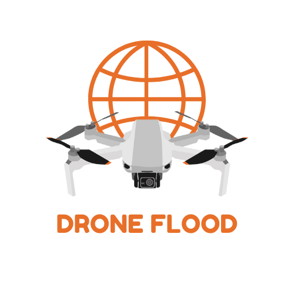
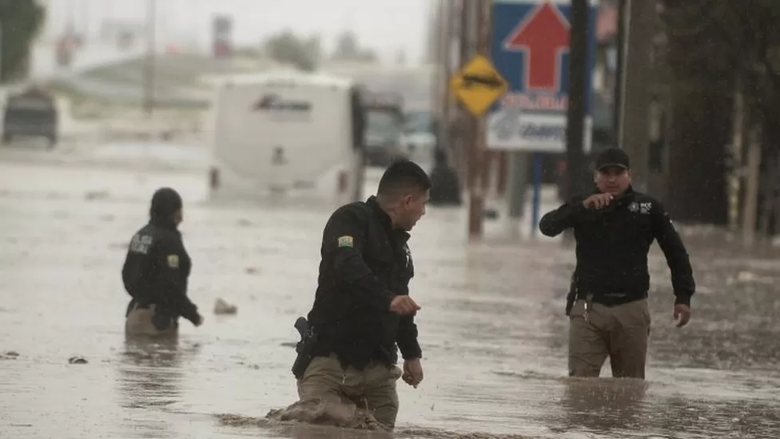
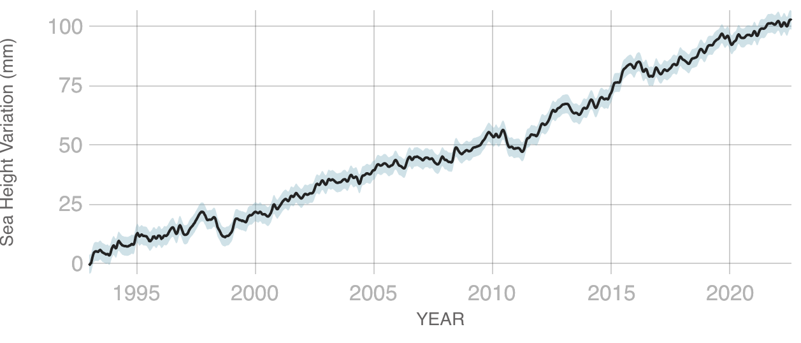
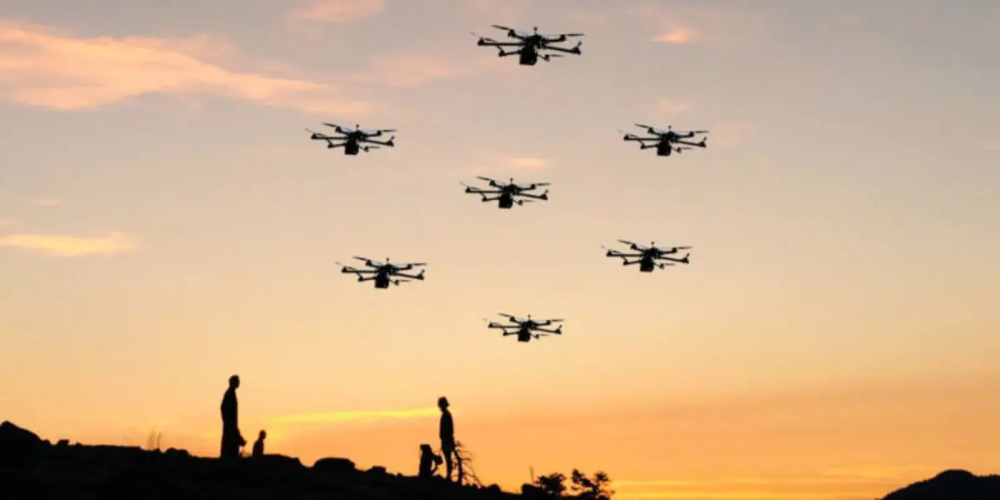
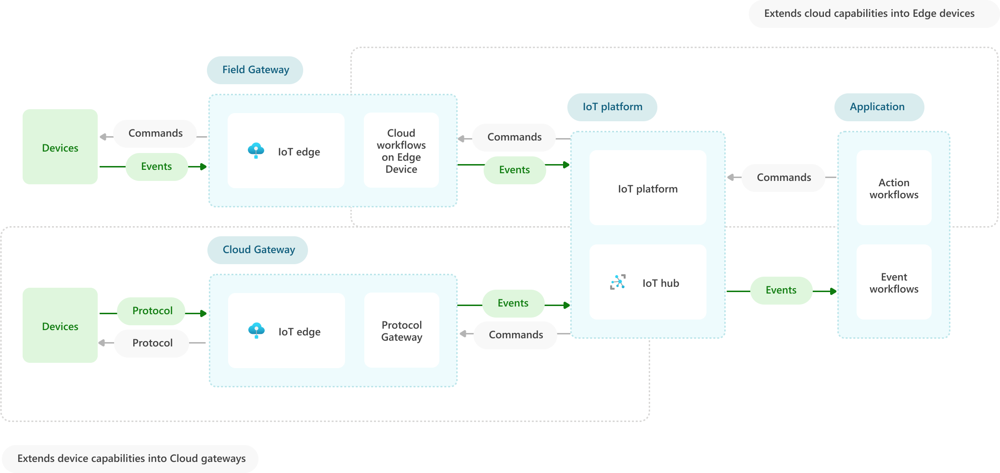
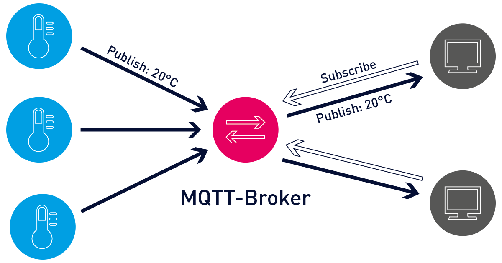
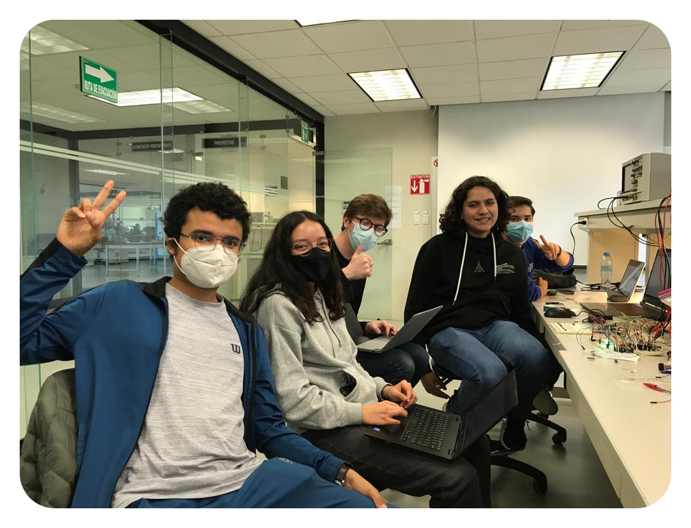

<!-- Improved compatibility of back to top link: See: https://github.com/othneildrew/Best-README-Template/pull/73 -->

<!-- PROJECT LOGO -->
 

    
    

        <em>"For every disaster there's a solution"</em>
    

    <a href="https://github.com/AntonioLaurance/DronesFlood/tree/main/src">
        <strong>Explore the source code »</strong>

 

![Contributors][contributors-shield]
![Forks][forks-shield]
![Stargazers][stars-shield]
![Issues][issues-shield]
[![GPL License][license-shield]][license-url]

<!-- TABLE OF CONTENTS -->

    
Table of Contents

    <ol>
        <li><a href="#motivation">Motivation</a></li>
        <li><a href="#objectives">Objectives</a></li>
        <li><a href="#learning-goals">Learning Goals</a></li>
        <li><a href="#especifications">Especifications</a></li>
        <li><a href="#requirement-features">Requirement Features</a></li>
        <li><a href="#license">License</a></li>
        <li><a href="#developers">Developers</a></li>
        <li><a href="#acknowledgments">Acknowledgments</a></li>
    </ol>

<!-- PROJECT'S MOTIVATION -->
## Motivation

Since the Industrial Revolution, a process that took place around the 18th and 19th centuries, the global average temperature has had a rapid increase that, although sounds insignificant, has severe impacts on our environment and on the way in which the future will probably go on (if it does). This *"insignificant"* growth of a little more than 1 degree Celsius, in fact, has triggered the [warmest](https://www.nrdc.org/stories/global-warming-101) of times in all of human history.

You might be wondering: How will a warmer world affect me? Well, it's simple. Rising temperatures are worsening something we all fear: natural disasters, which at the same tiem longer and hotter heat waves, worse and more frequent droughts, unimaginably powerful hurricanes, and of course, more intense and uncontrollable rains.

    

    

        <strong>Figue 1. </strong>Flooding in Monterrey, Mexico (<a href="https://www.bbc.com/news/world-latin-america-53553633">BBC News</a>)
    

In addition, this warmer climate has another collateral effect, which is the rise in sea level, an additional consequence that although is mainly caused by global warming, its two main causes are the expansion of sea water (a phenomenon that occurs when it gets warm) and of course, the added water from melting ice caps and glaciers, thus, having a total average sea level rise since 1993 of [102.5 mm](https://climate.nasa.gov/vital-signs/sea-level/#:~:text=Global%20sea%20levels%20are%20rising,of%20seawater%20as%20it%20warms.).

    

    

        <strong>Figue 2. </strong>Sea level rise in the last few decades. (<a href="https://climate.nasa.gov/vital-signs/sea-level/#:~:text=Global%20sea%20levels%20are%20rising,of%20seawater%20as%20it%20warms.">NASA</a>)
    

    
Every year, these natural disasters devastate millions of people, numerous communities, and even entire societies worldwide. Evidently, the consequences of diasters are bigger when talking about countries in current development. Taking this into consideration, both [Mexico and Brazil](https://www.hks.harvard.edu/sites/default/files/centers/cid/files/publications/fellow_graduate_student_working_papers/043.pdf) are regions that should prioritize the creation and optimization of protocols, systems and even engineering solutions as an imperative prevention for any unconventional event, as these are countries that lie within  one of the world’s most active seismic regions; prone to constant droughts and in the path of hurricanes and tropical storms originating in the Caribbean Sea, Atlantic and Pacific Oceans. Indeed, this wide geographic exposure renders that a high share of the country’s population may be at hazard risk.
    
Hence, it is highly important to develop a effective network that can provide internet access to people affected by any disaster so that they can communicate with emergency services even in the case that a communication shortage occurs, increase survival rates after simmilar incidents, quickly mitigate dangers to a region's population, and even help prevent greater catastrophes. Thus, the engineering of a proposal that incorporates a holistic approach and integral implementation of the Internet of Things as an advanced automation and analytics system that mainly incorporates drone networking, electronic and hardware connections, and cloud messaging through brokers and servers become fundamental to the construction of a robust, complete and resilient telecommunication infrastructure capable of sustaining emergency services in natural incidents. As a consequence, the motivation to work in a diverse group of engineers that aim to tackle one of the most frequent and important challenges of Latin American societies grows and fuels the technological development required to innovate and connect humanity in the most needed of times, once again demonstrating our endurance, strength, empathy and willingness to thrive.

    

    

        <strong>Figue 3. </strong>Drone fleet to provide internet access for affected areas. (<a href="https://dronedj.com/2021/10/07/blockchain-tech-may-thwart-hacks-of-automated-drone-fleets/">Crumley, B.</a>)
    

(<a href="#readme-top">back to top</a>)

<!-- PROJECT'S OBJECTIVES -->
## Objectives

Taking into account what was said above, and after analyzing the various existing alternatives to carry out this solution, we have opted for its implementation based on the multistage architecture of the Internet of Things (IoT), in which it is considered the most efficient way, first, the collection of data, and then, the processing of this data and decision making based on a model which consists of 4 stages. These 4 stages are sensors and actuators, IoT Gateway, Edge IT, Cloud, which respectively obtain, react, aggregate, pre-process and process data extremely efficiently.

    

    

        <strong>Figue 4. </strong>Internet of Things Architecture Implemented. (<a href="https://learn.microsoft.com/en-us/azure/architecture/example-scenario/iot/field-cloud-edge-gateways">Microsoft</a>)
    

(<a href="#readme-top">back to top</a>)

For this implementation, as a team of developers, we will jointly build a native Android transaction-based mobile application capable of obtaining information from the victims of the flood, such as the severity, a short message describing their situation and, of course, their exact location. Of course, this is where the drones take place, because as we can all conclude, Internet access will be very poor or impossible, drones being a method of providing a few minutes of Internet access to know where the victims are and how serious their condition is.

    

    

        <strong>Figue 5. </strong>User interface of android application. (<a href="https://github.com/kabartsjc/gsl-iot-2022/blob/main/SOLUTION_DESCRIPTION.md">Barreto, A.</a>)
    

(<a href="#readme-top">back to top</a>)

The backbone of this project is the IoT protocol the solution relies on, given that, a very limited quantity of resources is at reach of the victims. In this case, the protocol used is the MQTT Broker, a protocol that is very lightweight and uses almost no energy at all, capable of machine to machine (M2M) communications neccesary for this context. In addittion, to implement this, as a team, we decided to use the open-source implementation of this protocol whose name is Eclipse-Mosquitto, an implementation capable of connecting huge servers and limited smartphones, which allows us to use various network configurations depending on our necesities, being useful in this case, a bridge mode, which distiguishes from a local broker (drones) and a central broker (the server/virtual machine).

    

    

        <strong>Figue 6. </strong>MQTT Protocol example. (<a href="https://www.paessler.com/es/it-explained/mqtt">Paessler</a>)
    

(<a href="#readme-top">back to top</a>)

Once the communication between devices is resolved, it is important to consider how the data will be stored and then managed, in order to give the victims the best possible solution to their complicated situation. Regarding data storage, we will design and implement a relational database using the well-known MySQL DBMS that will receive the information generated by the victims through their smartphones, which, after being properly formatted, will be stored. Once this step is completed successfully, the database will be connected to a web application that will function as a dashboard that displays all the relevant information to the rescue forces to facilitate the deployment of a successful strategy capable of helping those in need the the most.

Finally, to fully test the capabilities of our solution, we have decided to implement both emulated and the real nodes to generate an then process, store and display their information. This process will use the Mininet-WiFi Network emulator, as well as some Python scripts that will jointly serve as nodes that emulate real people sharing their location, status, and a message. And then, we will use a real node based on an Android phone using the developed mobile application, which, like the emulated nodes, will send its location, status and a short message.

(<a href="#readme-top">back to top</a>)

<!-- Learning Goals -->
## Learning Goals

- Design, elaborate and analyse digital systems based upon the Internet of Things networks and environments.
- Design and develop databases for the analysis of real-life applications of hard data.
- Implement the management of a computer system's resources as a fundament for the development of engineering projects.
- Incorporate principles of Interactive Design to optimize engineering solutions.
- Build up expertise for the correct and integral Project and Process Management requirements to sustain technical developments.

(<a href="#readme-top">back to top</a>)

<!-- ESPECIFICATIONS -->
## Especifications

    
[![forthebadge][badge-web]][badge-web]

[![made-with-python][badge-python]][python-url]

(<a href="#readme-top">back to top</a>)

<!-- Features -->
## Requirement Features
In order to achieve the best results in the implementation of this challenge's solution, several characteristics and requirements need to be considered, including:

- The development of a system of digital devices based on 5 microcontrollers, interconnected in a data network and programmed for the exchange of information through the MQTT communication protocol.
- The design and implementation of an information architecture in an information hosting service in the Cloud, which enables data collection, communication between devices, and the generation of control actions in real time.
- Programming, interconnection and commissioning of devices that, within the home automation network, implement specific functionalities for data acquisition, actuator control and information generation for network services.
Analysis of requirements, planning and administration of the execution process of the implementation of the home automation system described above.
    

(<a href="#readme-top">back to top</a>)

<!-- LICENSE -->
## License

Distributed under the GNU General Public License (GPL). See [license](https://github.com/AntonioLaurance/DronesFlood/blob/main/LICENSE) for more information.

(<a href="#readme-top">back to top</a>)

<!--  DEVELOPERS & CONTACT-->
## Developers

    

- Ricardo Campos Luna - [GitHub](https://github.com/AntonioLaurance) - [Mail](mailto:a01656898@tec.mx)
- Noemí Abigail Curiel López - [GitHub](https://github.com/AbiCuriel) - [Mail](mailto:01655892@tec.mx)
- Moisés Adame Aguilar - [GitHub](https://github.com/MoisesAdame) - [Mail](mailto:a01660927@tec.mx)
- Juan Francisco Sánchez Sánchez - [GitHub](https://github.com/FranciscoSanchezz) - [Mail](mailto:a01656793@tec.mx)
- Jorge Diego Martell Fernández - [GitHub](https://github.com/A01661436) - [Mail](a01661436@tec.mx)

(<a href="#readme-top">back to top</a>)

<!-- ACKNOWLEDGMENTS -->
## Acknowledgments

* A special thanks to our teachers ❤️.

(<a href="#readme-top">back to top</a>)

<!-- MARKDOWN LINKS & IMAGES -->
<!-- https://www.markdownguide.org/basic-syntax/#reference-style-links -->
[contributors-shield]: https://img.shields.io/github/contributors/AntonioLaurance/DronesFlood.svg?style=for-the-badge
[contributors-url]: https://github.com/AntonioLaurance/DronesFlood/graphs/contributors
[forks-shield]: https://img.shields.io/github/forks/AntonioLaurance/DronesFlood.svg?style=for-the-badge
[forks-url]: https://github.com/AntonioLaurance/DronesFlood/network/members
[stars-shield]: https://img.shields.io/github/stars/AntonioLaurance/DronesFlood.svg?style=for-the-badge
[stars-url]: https://github.com/AntonioLaurance/DronesFlood/stargazers
[issues-shield]: https://img.shields.io/github/issues/AntonioLaurance/DronesFlood.svg?style=for-the-badge
[issues-url]: https://github.com/AntonioLaurance/DronesFlood/issues
[license-shield]: https://img.shields.io/github/license/AntonioLaurance/DronesFlood.svg?style=for-the-badge
[license-url]: https://github.com/AntonioLaurance/DronesFlood/blob/main/LICENSE
[badge-python]: http://ForTheBadge.com/images/badges/made-with-python.svg
[python-url]: https://www.python.org/
[badge-coders-sweat]: https://forthebadge.com/images/badges/powered-by-coders-sweat.svg
[badge-web]: fig/buil-for-the-web.svg
